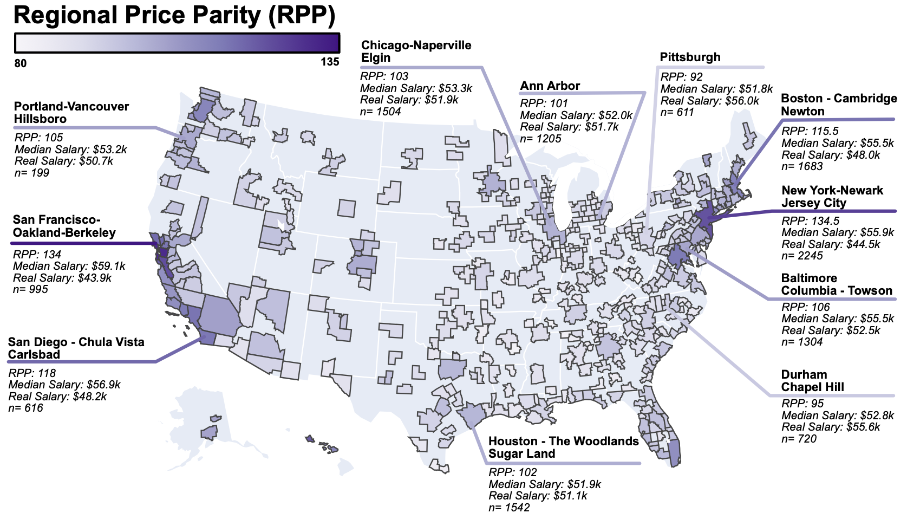

American postdoctoral salaries do not account for growing disparities in cost of living (paper)
==============================

### Abstract

The National Institute of Health (NIH) sets postdoctoral (postdoc) trainee stipend levels that many American institutions and investigators use as a basis for postdoc salaries. Although salary standards are held constant across universities, the cost of living in those universities' cities and towns vary widely. Across non-postdoc jobs, more expensive cities pay workers higher wages that scale with an increased cost of living. This work investigates the extent to which postdoc wages account for cost of living differences. 
More than 27,000 postdoc salaries across all US universities are analyzed alongside measures of regional differences in cost of living. 
We find that postdoc salaries do not account for cost of living differences, in contrast with the broader labor market in the same cities and towns. Despite a modest increase in income in high cost of living areas, real (cost of living adjusted) postdoc salaries differ by 29% ($15k 2021 USD) between the least and most expensive areas. 
Cities that produce greater numbers of tenure-track faculty relative to students such as Boston, New York, and San Francisco are among the most impacted by this pay disparity. The postdoc pay gap is growing and is well-positioned to incur a greater financial burden on economically disadvantaged groups and contribute to faculty hiring disparities in women and racial minorities.

### Citation

**published version available soon**

.. code:: bibtex

    @article{sainburg2022postdoc,
        author = {Sainburg, Tim},
        title = {American postdoctoral salaries do not account for growing disparities in cost of living},
        journal = {ArXiv e-prints},
        archivePrefix = "arXiv",
        eprint = {2205.12892},
        primaryClass = "econ.GN",
        year = 2022,
        }

### Using this code / data

All cleaning, preprocessing, and analyses are done in Jupyter Notebooks, which are numbered in order. All processed data are available in the data folder. All raw data are linked in the manuscript. The only raw data not in this repo are the H1B data, which are available at https://www.dol.gov/agencies/eta/foreign-labor/performance

--------

<small>Project based on the <a target="_blank" href="https://drivendata.github.io/cookiecutter-data-science/">cookiecutter data science project template</a>. #cookiecutterdatascience</small>

